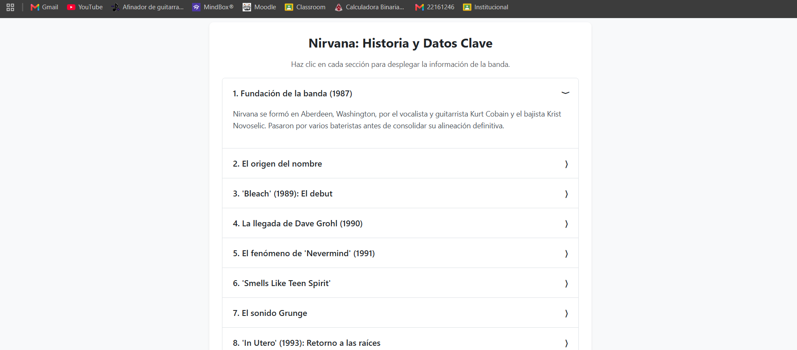
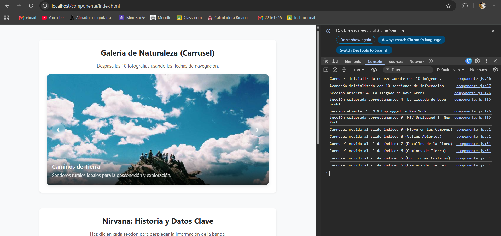

### Actividad 3 - Tema 2: Componentes 

### Portada
* **Nombre:** Santiago Vasquez David Osmar
* **Materia:** Programación Web
* **Docente:** Martinez Nieto Adelina

---

### ¿Qué problema resuelve?

Este componente resuelve el problema de maquetar elementos dinámicos y repetitivos en la interfaz de usuario sin necesidad de duplicar código estructurado ni estilos pesados. 

En lugar de crear un carrusel o un acordeón de forma manual para cada sección de contenido diferente, esta librería permite inyectar estructuras dinámicas de manera automatizada utilizando arreglos de parámetros lógicos desde JavaScript (URLs, títulos, descripciones, etc.).

El componente puede utilizarse en cualquier página web para desplegar galerías multimedia adaptativas o catálogos informativos colapsables optimizando el espacio visual de la pantalla.

---

### Instalación

Para utilizar el componente se deben enlazar los archivos CSS y JavaScript dentro del HTML.

```html
<link rel="stylesheet" href="css/componente.css">

<script src="js/componente.js"></script>
```

---

### Uso con ejemplos
## Carrusel
```javascript 
inicializarCarrusel(contenedorId, datos)
```
Esta función crea y muestra un carrusel de imágenes interactivo en pantalla. Recibe el identificador del contenedor destino y un arreglo de objetos con la información multimedia.

## Ejemplo de uso Carrusel
```html
<div id="mi-carrusel-contenedor"></div>

<script>
    // Inicialización del componente visual con contenido personalizado
    inicializarCarrusel('mi-carrusel-contenedor', [
        { url: '[https://picsum.photos/id/10/750/375](https://picsum.photos/id/10/750/375)', titulo: 'Bosque Profundo', desc: 'Luz solar filtrándose entre los árboles.' },
        { url: '[https://picsum.photos/id/15/750/375](https://picsum.photos/id/15/750/375)', titulo: 'Rocas del Desierto', desc: 'Formaciones esculpidas por el viento.' },
        { url: '[https://picsum.photos/id/28/750/375](https://picsum.photos/id/28/750/375)', titulo: 'Bosque de Coníferas', desc: 'Inmensos senderos rodeados de pinos.' },
        { url: '[https://picsum.photos/id/29/750/375](https://picsum.photos/id/29/750/375)', titulo: 'Montañas Rocosas', desc: 'Cumbres imponentes bajo un cielo despejado.' },
        { url: '[https://picsum.photos/id/37/750/375](https://picsum.photos/id/37/750/375)', titulo: 'Campos Visuales', desc: 'La perspectiva de un terreno abierto e infinito.' },
        { url: '[https://picsum.photos/id/49/750/375](https://picsum.photos/id/49/750/375)', titulo: 'Horizontes Costeros', desc: 'Oles constantes golpeando acantilados.' },
        { url: '[https://picsum.photos/id/54/750/375](https://picsum.photos/id/54/750/375)', titulo: 'Caminos de Tierra', desc: 'Senderos rurales ideales para la exploración.' },
        { url: '[https://picsum.photos/id/116/750/375](https://picsum.photos/id/116/750/375)', titulo: 'Flora Nativa', desc: 'Hojas capturando la humedad ambiental.' },
        { url: '[https://picsum.photos/id/124/750/375](https://picsum.photos/id/124/750/375)', titulo: 'Valles Abiertos', desc: 'Praderas extensas que muestran diversidad.' },
        { url: '[https://picsum.photos/id/141/750/375](https://picsum.photos/id/141/750/375)', titulo: 'Cumbres Nevadas', desc: 'El crudo invierno transformando el paisaje.' }
    ]);
</script>
```
## Acordeón
```javascript 
inicializarAcordeon(contenedorId, secciones)
```
Esta función crea y muestra un acordeón de secciones interactivo en pantalla. Recibe el identificador del contenedor destino y un arreglo de objetos con la información de cada sección.

## Ejemplo de uso acordeón
```html
<div id="mi-carrusel-contenedor"></div>

<script>
    // Inicialización del componente visual con contenido personalizado
    inicializarCarrusel('mi-carrusel-contenedor', [
        { url: '[https://picsum.photos/id/10/750/375](https://picsum.photos/id/10/750/375)', titulo: 'Bosque Profundo', desc: 'Luz solar filtrándose entre los árboles.' },
        { url: '[https://picsum.photos/id/15/750/375](https://picsum.photos/id/15/750/375)', titulo: 'Rocas del Desierto', desc: 'Formaciones esculpidas por el viento.' },
        { url: '[https://picsum.photos/id/28/750/375](https://picsum.photos/id/28/750/375)', titulo: 'Bosque de Coníferas', desc: 'Inmensos senderos rodeados de pinos.' },
        { url: '[https://picsum.photos/id/29/750/375](https://picsum.photos/id/29/750/375)', titulo: 'Montañas Rocosas', desc: 'Cumbres imponentes bajo un cielo despejado.' },
        { url: '[https://picsum.photos/id/37/750/375](https://picsum.photos/id/37/750/375)', titulo: 'Campos Visuales', desc: 'La perspectiva de un terreno abierto e infinito.' },
        { url: '[https://picsum.photos/id/49/750/375](https://picsum.photos/id/49/750/375)', titulo: 'Horizontes Costeros', desc: 'Oles constantes golpeando acantilados.' },
        { url: '[https://picsum.photos/id/54/750/375](https://picsum.photos/id/54/750/375)', titulo: 'Caminos de Tierra', desc: 'Senderos rurales ideales para la exploración.' },
        { url: '[https://picsum.photos/id/116/750/375](https://picsum.photos/id/116/750/375)', titulo: 'Flora Nativa', desc: 'Hojas capturando la humedad ambiental.' },
        { url: '[https://picsum.photos/id/124/750/375](https://picsum.photos/id/124/750/375)', titulo: 'Valles Abiertos', desc: 'Praderas extensas que muestran diversidad.' },
        { url: '[https://picsum.photos/id/141/750/375](https://picsum.photos/id/141/750/375)', titulo: 'Cumbres Nevadas', desc: 'El crudo invierno transformando el paisaje.' }
    ]);
</script>
```
---

### Capturas de pantalla






---

## Video de la actividad

[▶️ Haz clic aquí para ver el Video Demo Promocional de la Utilería JS](https://drive.google.com/drive/folders/18WEA9IpnDZ2tvLbZW_N8ctalFpfSGNWD?usp=sharing)